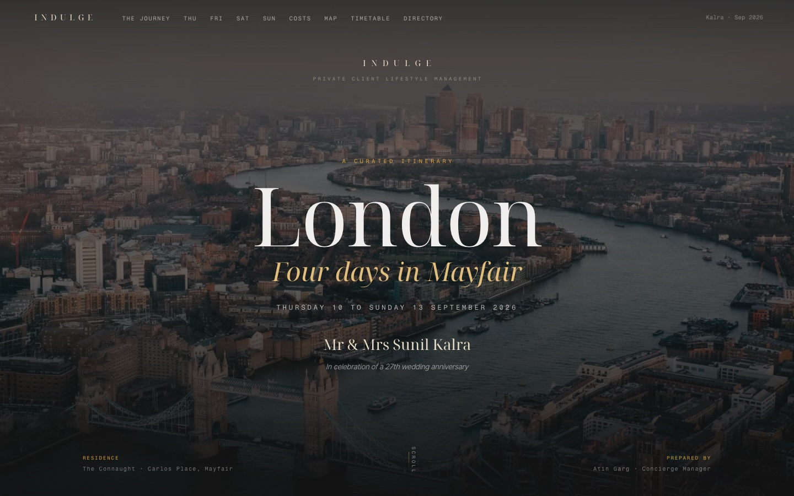

# London · Four Days in Mayfair

**A luxury concierge itinerary, delivered as a working website.**

### 🔗 Live site: **[indulge-london-itinerary.vercel.app](https://indulge-london-itinerary.vercel.app)**

[](https://indulge-london-itinerary.vercel.app)

Prepared by **Atin Garg** as part of the Indulge Global concierge assessment.

---

## At a glance

| | |
|---|---|
| **Brief** | A luxury London itinerary for a discerning client |
| **Client profile** | An illustrative couple travelling from Delhi for their 27th wedding anniversary |
| **Dates** | Thursday 10 to Sunday 13 September 2026, three nights |
| **Residence** | The Connaught, Grosvenor Suite, Mayfair |
| **Programme** | 13 venues and experiences across 35 scheduled movements |
| **Budget** | £23,339 for two guests, built only from quoted or published figures |
| **Delivered as** | An interactive website, live on Vercel |

## Contents

1. [The project](#1-the-project)
2. [The objective](#2-the-objective)
3. [The client](#3-the-client)
4. [How I approached it](#4-how-i-approached-it)
5. [Research, and what it changed](#5-research-and-what-it-changed)
6. [The itinerary](#6-the-itinerary)
7. [The investment](#7-the-investment)
8. [The solution: from document to website](#8-the-solution-from-document-to-website)
9. [How it was delivered](#9-how-it-was-delivered)
10. [The outcome](#10-the-outcome)
11. [Technical notes](#11-technical-notes)
12. [Photography and credits](#12-photography-and-credits)

---

## 1. The project

Indulge Global is a private luxury concierge for high net worth families. Its candidate assessment
for a concierge role asks for a short luxury London itinerary for a discerning client, covering
restaurants, bars, shopping, experiences and attractions. Recommendations have to come from reputable
publications and official business sources rather than generic content, and the work is judged on
quality, accuracy, presentation, attention to detail and speed.

This repository is that submission. It began as a researched spreadsheet, became a fully reasoned
client document, and was finally rebuilt as the website linked above.

## 2. The objective

The brief sets the minimum. I set three goals on top of it.

1. **Be operationally correct, not just attractive.** Every recommendation had to survive being
   checked against the business's own rules: opening days, booking policies, dress codes, age limits
   and service windows. A beautiful plan that fails at the door is a liability.
2. **Build the days around the guests, not the attractions.** One significant commitment per half
   day, nothing that forces a rushed meal, and every day shaped by who is travelling and why.
3. **Show how Indulge itineraries could be delivered in future.** Not a spreadsheet and not a PDF
   attachment, but a page the client opens on their phone on the morning, where every address, phone
   number and map link is one tap away.

## 3. The client

An illustrative profile, used to make every decision concrete.

| Detail | What it meant for the plan |
|---|---|
| Couple flying business class from Delhi | Landing at 15:20 after nearly ten hours in the air, so Thursday had to ask nothing of them |
| Celebrating a 27th wedding anniversary | The trip needed one day that is unmistakably the celebration |
| Frequent international travellers | Sterling only, no currency conversion cluttering the page |
| Value comfort and time over sightseeing volume | Private chauffeur for out of town days, black cabs in town, walking distance wherever possible |

## 4. How I approached it

The work ran in five stages, each one checked before the next began.

**Stage 1. Draft.** A working spreadsheet with a row for every slot of the trip: date, start and end
time, activity, category, location, rationale, cost and source link. This forced every gap and
transfer to be accounted for, not just the highlights.

**Stage 2. Verify.** Every business name, website, telephone number, address and opening time was
checked against the operator's own official website. Where an official source did not exist, I used
VisitLondon, the official visitor guide from London & Partners, and for UK Sunday trading law, the
House of Commons Library briefing SN05522. This stage changed the plan more than any other. See
[section 5](#5-research-and-what-it-changed).

**Stage 3. Reason.** An A4 client document explaining why each day sits where it does, a full costed
breakdown, a verified contact directory, and a separate page of operational notes for the concierge
team covering every point where a booking could quietly fail.

**Stage 4. Design.** A wireframe of the website, agreed section by section before any code was
written. The approved wireframe is still [viewable here](https://indulge-london-itinerary.vercel.app/wireframe/wireframe).

**Stage 5. Build, test, ship, refine.** The site was built, tested in a real browser at phone, tablet
and desktop sizes, deployed, verified again in production, and then refined across several rounds of
review.

## 5. Research, and what it changed

These are the findings that actually moved something in the plan.

| Finding | What it changed |
|---|---|
| St George's Chapel admits visitors only on Monday, Thursday, Friday and Saturday, and Windsor Castle is closed on Tuesday and Wednesday | Windsor went on **Saturday**. A Sunday visit would have meant no chapel at all |
| UK Sunday trading law caps large shops at six hours between 10:00 and 18:00. In practice flagships open for browsing at 11:30 and sell from 12:00 | Bicester Village moved to **Friday**, a full twelve hour trading day. Sunday morning went to the Tower of London, and Sunday afternoon to Burlington Arcade |
| "VIP dinner cruise" is reseller language, not a product any operator sells from Westminster Pier. Bateaux London ceased trading in late 2023, though its website still reads as if it runs | The evening became the genuine **City Cruises London Dinner Cruise** from Westminster Pier, with a window table for two requested by name |
| The Connaught includes access to the Aman Spa in the room rate | The **deciding factor** between comparable Mayfair hotels. Friday's couple's ritual adds nothing to the budget, against roughly £600 for the same treatment booked elsewhere |
| Hélène Darroze is closed Sunday and Monday and serves dinner across a two and a half hour window | The hardest reservation on the trip, secured first and placed on **Friday**, straight after the spa, without leaving the building |
| Dishoom accepts bookings for a party of two only until 17:45 | A 19:30 arrival is a walk in, so the concierge team either holds the queue or moves the table to Dishoom Carnaby, a short walk from the hotel |
| Cecconi's at Bicester Village takes bookings for breakfast and dinner but is walk in only at lunch | The table is arranged directly with the restaurant, or through one of its private hire spaces |
| The Tower of London has no luggage storage and refuses large wheeled bags | On departure day every bag stays with The Connaught until the 16:00 car |
| The Gusbourne tasting is strictly 18 and over, and dietary requirements need 72 hours notice | Flagged at the point of booking rather than discovered on the day |
| Mid September falls inside the British game season | Rules, established 1798 and the oldest restaurant in London, became the final lunch, with grouse, partridge and venison from its own estate |

### Deliberate choices

**No separate bars section.** The brief mentions bars, and this was a considered decision rather than
an omission. Every dining venue carries a serious wine and cocktail list, Friday's three Michelin star
dinner includes a sommelier pairing, Saturday has a dedicated English sparkling wine tasting, and the
Connaught Bar, one of the most decorated bars in the world, is downstairs from the suite. A list of
bars would have padded the trip rather than improved it.

**Two audiences, two versions.** The operational notes above belong to the concierge team. The client
facing website presents every booking as already held, because a client should never have to read
about what might go wrong with their own anniversary.

## 6. The itinerary

### Day I · Thursday 10 September · Arrival

| Time | Plan |
|---|---|
| 10:05 to 15:20 | British Airways 256, Delhi to Heathrow Terminal 5, business class |
| 16:30 to 17:15 | Private chauffeur into Mayfair, meet and greet with flight tracking |
| 17:15 to 19:00 | Check in at The Connaught, Grosvenor Suite |
| 19:30 to 21:30 | Dinner at Dishoom Covent Garden, deliberately informal after a long flight |

### Day II · Friday 11 September · The Anniversary

| Time | Plan |
|---|---|
| 08:30 to 10:00 | Chauffeur to Oxfordshire, timed for opening |
| 10:00 to 13:30 | Bicester Village, with a personal shopper and Hands Free Shopping |
| 13:30 to 14:30 | Lunch at Cecconi's Bicester Village |
| 16:30 to 19:00 | Couple's ritual at the Aman Spa, included in the room rate |
| 19:30 to 21:30 | The anniversary dinner at Hélène Darroze at The Connaught, three Michelin stars |

### Day III · Saturday 12 September · Castle, Wine and River

| Time | Plan |
|---|---|
| 10:00 to 13:30 | Windsor Castle and St George's Chapel |
| 13:30 to 15:00 | Lunch at The Ivy Royal Windsor, directly opposite the castle walls |
| 16:30 to 18:00 | Wine and cheese tasting aboard a sightseeing coach, pouring five Gusbourne wines, the estate commissioned for the 2023 coronation |
| 19:30 to 23:00 | Dinner cruise on the Thames from Westminster Pier, window table for two |

### Day IV · Sunday 13 September · Departure

| Time | Plan |
|---|---|
| 09:00 to 12:00 | Tower of London and the Crown Jewels, from opening |
| 12:30 to 14:00 | Lunch at Rules, Covent Garden |
| 14:30 to 15:45 | Burlington Arcade and Piccadilly |
| 16:30 to 20:35 | Chauffeur to Heathrow Terminal 2, then Air India 2018 to Delhi, business class |

The full hour by hour timetable, including every transfer, is on the [live site](https://indulge-london-itinerary.vercel.app/#timetable).

## 7. The investment

| Category | Amount | Share |
|---|---:|---:|
| Accommodation · The Connaught, three nights | £11,391 | 48.8% |
| Flights · business class, both sectors, two guests | £8,477 | 36.3% |
| Ground transport · chauffeurs and black cabs | £1,410 | 6.0% |
| Dining · five meals including three Michelin stars | £1,380 | 5.9% |
| Experiences · castle, Tower, tasting, cruise, shopping service | £681 | 2.9% |
| **Total, four days, two guests** | **£23,339** | |

Accommodation and flights carry 85 percent of the total, which is normal at this level and worth
knowing before anything is trimmed: removing every experience entirely would save less than three
percent.

## 8. The solution: from document to website

The client document was complete and accurate, but a PDF is the wrong shape for how a client actually
uses an itinerary: on a phone, in a car, looking for the next address. The website keeps all of the
substance and makes it usable.

### Design decisions

- **Indulge's own brand identity**, taken directly from indulge.global rather than invented: ink
  `#121212`, gold `#D29C33`, cream `#E8DDC6` and off white `#EFEEEC`, set in Noto Serif Display,
  Inter Tight and Fragment Mono. The only addition is a muted green, used for one thing: marking
  something already reserved or already included.
- **Time on the left, activity on the right**, on every row, so a day reads like a schedule at a
  glance.
- **Experiences look like experiences, and movement looks like movement.** A venue gets a photograph,
  its full address, links to its website and to Google Maps, a tap to call telephone number, a
  reserved marker and an expandable details panel. A transfer is a single quiet grey line.
- **Nineteen photographs, one per experience, never repeated.** The hotel appears twice in total, once
  from the street and once inside the suite, not every time the guests return to it. Nothing
  illustrates a taxi, a transfer or a checkout.
- **Plain, warm English**, written for the client rather than about them. No jargon and no filler.

### What the site does

- **The journey:** both flights as boarding pass cards with the actual business class cabins, and the
  residence
- **The shape of the trip:** a four by three grid of every morning, afternoon and evening, each cell a
  link to that moment
- **Why the days sit in this order:** the reasoning, day by day
- **Four day pages:** the full schedule with photography, addresses, links and details
- **The investment:** an expandable cost table with a chart that draws itself on scroll
- **The map:** every venue pinned. Choosing a single day draws that day's actual route, out from The
  Connaught, through each stop in order and back again, with the route also written out in words
- **Master timetable:** all 35 movements, filterable by day
- **Contact directory:** every business, searchable, with live website and telephone links

## 9. How it was delivered

**Wireframe first.** The structure, the day row layout and the photograph plan were agreed on a
wireframe before a line of the site was built. That is where "time on the left" and "no photographs
of transport" were settled.

**A deliberately simple build.** Plain HTML, CSS and JavaScript, with no framework and no build step.
For a document like this a framework adds nothing, while the simple version loads instantly, cannot
break between versions, and can be edited by anyone. All of the itinerary content lives in a single
file, so a changed time or price updates the day pages, the timetable, the map and the directory
together.

**Photography.** Landmarks from Wikimedia Commons under Creative Commons licences, and hotel,
restaurant and cabin imagery from the venues and publications themselves. Every image was converted to
WebP at two widths and checked to be sharp at its actual display size. One photograph that looked fine
as a thumbnail but would have rendered at 0.76 times its needed resolution was caught and replaced.

**Testing in a real browser**, at phone, tablet and desktop widths. Problems found and fixed along the
way included venue photographs sitting indented from their own text because of a default browser
margin, a sticky timetable header that silently failed to stick inside a scrolling container, map pins
numbered out of sequence once filtered, and captions that still described photographs after those
photographs had been replaced.

**Verified in production, not just locally.** After deploying, the live site itself was checked: all
nineteen images serving, the three typefaces genuinely loading rather than falling back, the map
library passing its integrity check from the CDN, and the removed content genuinely gone.

**Refined across review rounds.** Feedback shaped the final version substantially. The anniversary
moved to Friday so that the shopping, the spa and the three star dinner form the celebration itself.
The Saturday tasting was described as what it actually is. Operational risk notes came out of the
client view. Fifteen photographs were replaced with better matched images, the opening sections were
enlarged, and the day routes were added to the map.

## 10. The outcome

A complete, verified, client ready itinerary, live at
**[indulge-london-itinerary.vercel.app](https://indulge-london-itinerary.vercel.app)**.

- **Four days, 13 experiences and 35 scheduled movements**, each checked against the operator's own
  rules before it went in
- **A fully costed budget of £23,339**, every line a quoted or published figure
- **Every business one tap away:** 13 venues with website and map links, a tap to call number wherever
  the business publishes one, and a searchable directory of all contacts
- **Four day routes** traced on a live map
- **Works on any device**, from a 375 pixel phone to a wide desktop, with no horizontal scrolling
- **Accessible:** keyboard navigable with visible focus, descriptive alternative text on every
  photograph, and reduced motion respected
- **A template for future itineraries:** because the content sits in one file, the same site can carry
  a different client, city and set of dates without redesigning anything

## 11. Technical notes

```
index.html              the page and its static sections
css/style.css           the complete stylesheet, including print styles
js/itinerary.js         every piece of itinerary content, the single source of truth
js/app.js               renders the days, timetable, map and directory, and the interactions
assets/img/             19 photographs as WebP at two widths, plus credits.json
assets/video/           the looping London montage used behind the hero
wireframe/              the approved wireframe
docs/                   the preview image used in this README
vercel.json             caching and security headers
```

- **Stack:** HTML, CSS and vanilla JavaScript. Leaflet with CARTO map tiles for the map. Google Fonts
  for type. No build step and no dependencies to install.
- **Hosting:** Vercel, deployed automatically from this repository.
- **Performance:** responsive WebP images with `srcset`, lazy loading below the fold, and long lived
  caching on image and video assets. The hero video is a single 2.6 MB file that loads only on wide
  screens, and never when the viewer has asked for reduced motion or is on a metered connection.
- **Privacy:** the page is marked `noindex, nofollow` so it does not appear in search results, and
  personal contact details are masked throughout.

## 12. Photography and credits

The hero background is a looping montage of four London clips from Mixkit, used under its free
stock video licence. Landmark photography is from Wikimedia Commons under Creative Commons licences, with each photographer
named in the footer of the live site. Hotel, restaurant, cabin and experience imagery is credited to
the venue, airline or publication it came from. All imagery is used solely for this non commercial
assessment, and any image will be removed promptly on request by its owner.

The client profile is illustrative. Venue details, prices and opening times were verified against
official sources at the time of writing, and would be reconfirmed with each business before travel.

**Research, curation and itinerary design:** Atin Garg
**Website:** built with Claude Code
